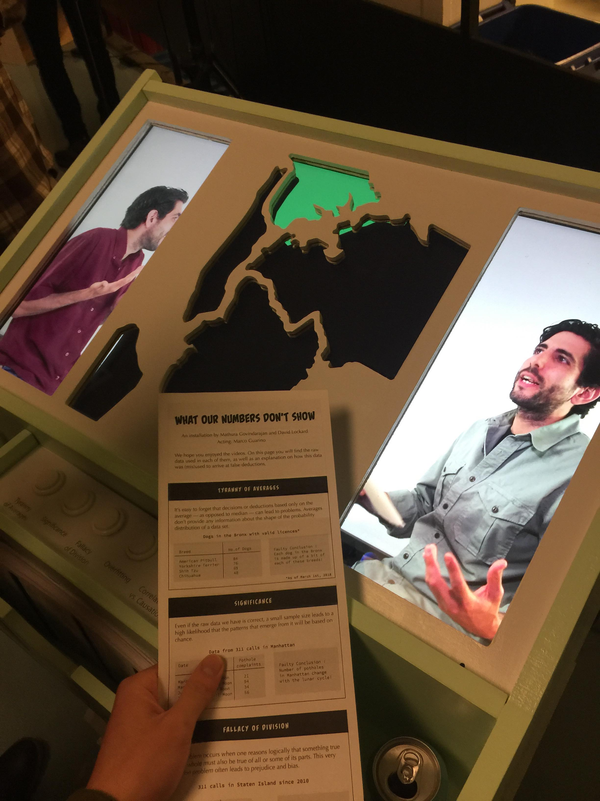
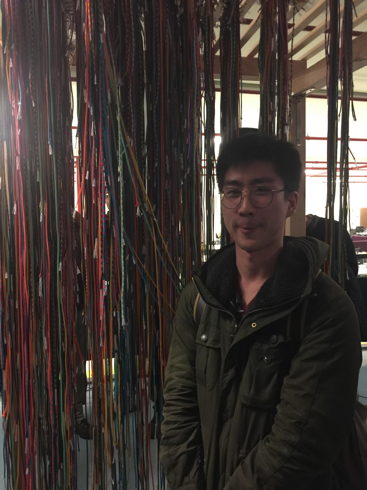
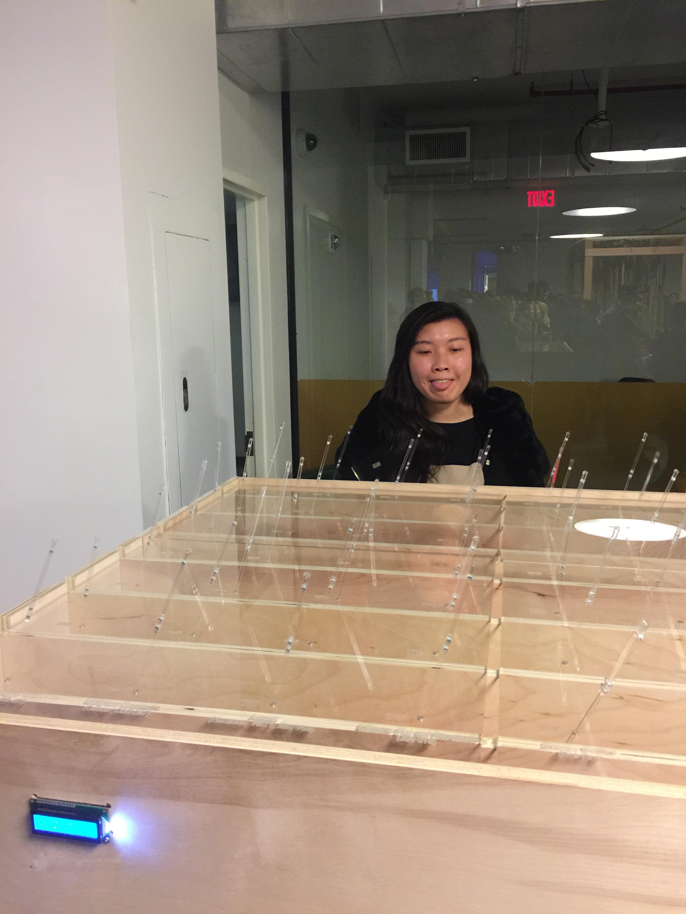
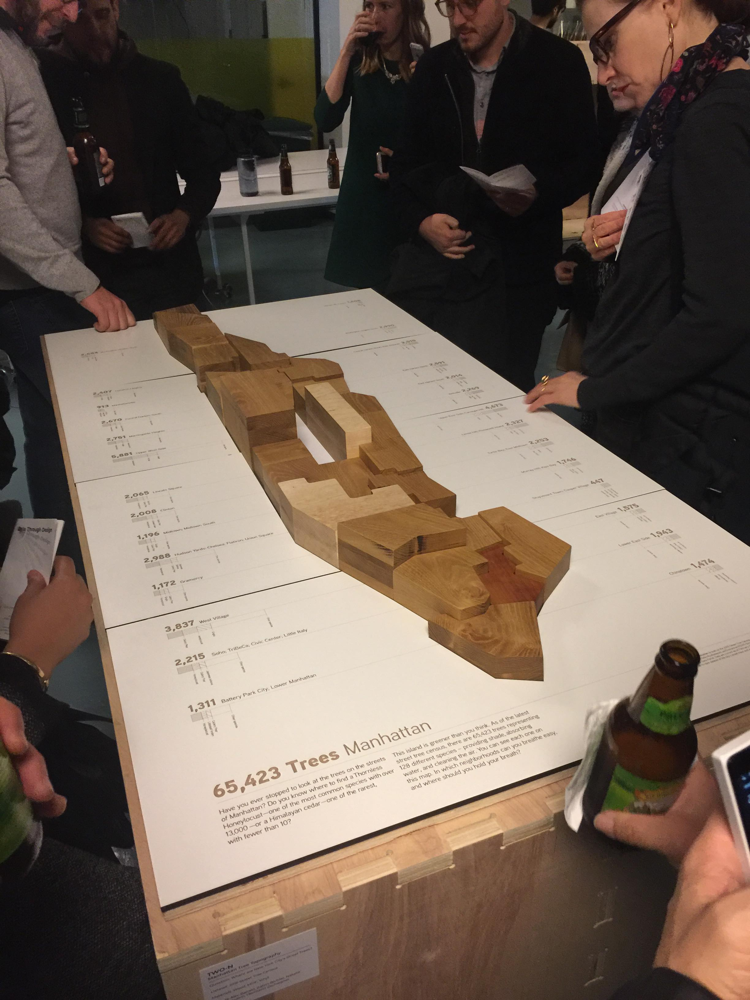
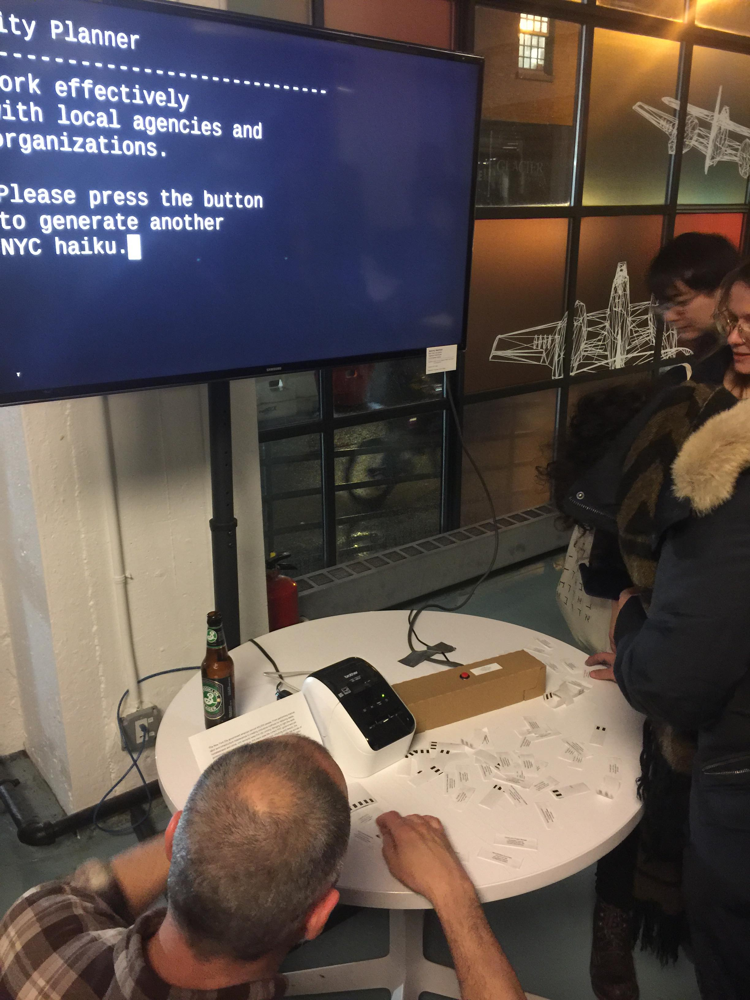

## Data Through Design: Opening Reception
### Friday, March 2 6:00 pm to 8:00 pm
So the weather was really terrible for this one. Although trudging through wind and rain isn't typically fun, I enjoyed 
complaining about it to Dora, Kenneth, and Dana. We met Ashley at the event and it seemed cool. I had initially thought
that there would be a speaker of some sort to kind of commence the whole Open Data Week thing, but turns out that it was
really more of a social gathering sort of thing. Everyone there seemed to be in a related field of some sort, and way
more seasoned that I am, so I was pretty shy to talk to a lot of the people browsing the available exhibits.

The exhibits were really awesome. Normally when I think about how best to represent data, I am not that imaginative. Data
visualization to me has always been about getting across an idea in the quickest, least biased way possible, so seeing these
art pieces was really cool and refreshing.

The first piece was pretty interesting. It was made up of these clear green boards with Manhattan on them on several red pegs
in each board. They were overlayed to represent something. I don't exactly remember what the data was supposed to represent,
but nothing was immediately apparent, and I remember not really understanding this one before or after reading the description. 

The next piece had a headset and several short videos detailing several terms and errors in data, such as significance, overfitting,
and modifiable areal unit problem. I was really interested in this one as it outlined what erros to avoid, and to not jump to
conclusions. The videos were really clear and entertaining, although some of them did not work. It also came with a sheet of paper
detailing all of the erros, with a small example within the context of a small dataset.

I didn't really understand the next one either. It was composed of a lot of cords hanging over a map of Manhattan. I think each cord 
was supposed to represent a minor crime, but it wasn't sure where the cords were supposed to land. I had Dora take a picture of me 
in the middle of these cords because I thought they looked like spaghetti. 

On an even bleaker note than spaghetti representing minor crimes was incidents of sexual assault at any given time in 2016 in 
Manhattan. This was represented by lights going off on a wooden board in colors that indicated severity. This format is incredible
for this data set and this data type. It shows the sheer insanity of the frequency of this type of incident. 

Another project had a bunch of little sticks or something that kind of twitched. It was supposed to represent deaths for 
each demographic in New York City but it was really confusing. 

Now, there is a project involving the amount of street trees in all of Manhattan represented each neighborhood of Manhattan with a 
wooden block, with the height of the block representing the amount of trees. It's funny because I had used this dataset in a 
database design homework that week, and seeing it represented so beautifully really struck a chord with me, because I had basically
thrown up pie charts and bar graphs. 

Lastly, there was this haiku generator, which I thought was cool, but I didn't play around with it too much. I couldn't tell if they 
were pregenerated haiku's or if they were generated by some sort of scraping or machine learning. 

## NYC Open Data Week @ NYU
### Monday, March 5 7:00 pm to 9:30 pm
So here there were three speakers at the front. I didn't quite catch their names, as I was little late, but they seem really cool and 
like they really know what they're talking about with open data and its usefulness, especially that lawyer guy. So I have worked in the
government at the Department of Transportation working in their records department. Although I can't say much of their data is open
to the public, I do know that it is messy, and unformatted. Basically Everything was in two columns in an excel sheet, and formats varied
as much as the people creating each record. When they started speaking of well documented data, I nearly shed tears.

They also spoke about getting open data, when it is not available on the web, how sometimes you have to keep emailing a person and 
repeatedly bother them. There are times, when someone has a traffic accident for an example, when they are allowed to see the data
in the DOT's archives, and I think you definitely need to bother the DOT for that information. One woman had shown up at the front 
door of the office. I felt like I could relate to a lot of what they were saying, when they expressed the need for open data conceptually.

During the Q and A the panelists were also asked about research and double checking data. My father used to do research, and he loved
to talk about how crazy for fame everyone who did research was. There is no fame in going back and redoing someone else's work for validation,
which is why so many studies report findings that could be wildly inaccurate. Verification is so important, but to go back and do it,
most of the time esepcially for individual cases, requires it to be done by hand. 

## Contributions
I haven't made any contributions this week.

### Previous
#### Total - 5 points
- **3 point** - report issues & comment on issues
- **1 point** - solve course website related issues and submit a PR that is accepted,
- **1 point** - contribute to WikiMedia projects,
- **0 point** - contribute to OpenMaps project,
- **0 point** - contribute to any Open… non-code writing project
